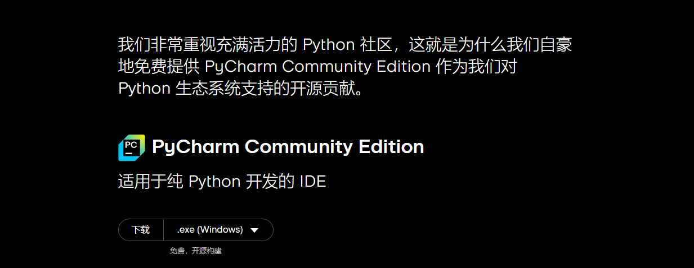
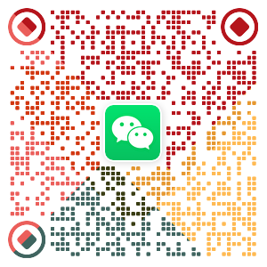

<div align="center">

<em style="font-size: 32px; font-weight: bold; color: red;">CuteAide2</em>
</div>

<h4 align="center" style="color: #FF5733;"> --->>>  开源的才是最好的  <<<---</h4>

> ‼️重要提示: 
> - 不建议打包成为 `.exe` 文件运行, 目前还没有做到程序深度隐藏, 打包后运行可能会被 PUBG 检测...
> - 不建议打包成为 `.exe` 文件运行, 目前还没有做到程序深度隐藏, 打包后运行可能会被 PUBG 检测...
> - 不建议打包成为 `.exe` 文件运行, 目前还没有做到程序深度隐藏, 打包后运行可能会被 PUBG 检测...

<hr/>

一个能够自动识别 PUBG 装备、自动压枪的软件, 帮助你更轻松的游戏🎮.

本人由于工作原因, 已无力适配所有设备, 特此将项目开源, 后续仅对自己设备及使用习惯进行优化维护(和我一样的设备可以继续使用), 需要的朋友可以自行下载源码进行二次开发.

QQ 交流群：[679556431](https://qm.qq.com/cgi-bin/qm/qr?k=C_li-vF5tFboRacsQm7II86lwsY1P4gg&jump_from=webapi&authKey=IN7xudayhxrku/cQCHZkluKEZxuPQo2dX3UYei3E/vfGz932L96LV76u17VB4D8f)

> 特别说明:
> 1. 本软件仅供娱乐、学习交流, 请勿用于商业用途;
> 2. 本软件仅供 PUBG 游戏内使用, 请勿用于其他游戏;
> 3. 使用本软件造成的一切后果由使用者自行承担, 与作者无关.

## 效果展示

<div style="display: flex;">
    
    
</div>
<br/>
<div style="display: flex;">
    
    
</div>
<br/>
<div style="display: flex;">
    
    
</div>
<br/>

> 激活码说明:
> - 激活码网站使用的是 [独角数卡](https://github.com/assimon/dujiaoka) (https://github.com/assimon/dujiaoka) 开源项目搭建
> - 激活码可在 `tools/ace.py` 文件中的 `permanent_ka` 方法生成

## 本人设备环境


## 功能完成情况

### 已完成功能
- [x] 自动识别装备
- [x] 自动压枪
- [x] 单击长按压枪
- [x] 下蹲键切换
- [x] 悬浮窗显示/隐藏
- [x] 丢雷倒计时 (切换到手雷, 鼠标左键按下时点击 R 键, 倒计时开始)
- [x] 地图距离测量 (打开地图, 按下 alt 键, 鼠标右键点击第二次时自动显示距离)
- [x] 密室显示 (打开地图后自动显示, 按键盘 ⬆️ ⬇️ 切换)

### 待完成功能
- [ ] 软件进程深度隐藏
- [ ] 自动音量调节
- [ ] 一件滑步
- [ ] 自动拾取
- [ ] 系统驱动
- [ ] Ghub 最新版驱动
- [ ] 后续功能待定...


## 项目下载使用

### 0. 环境准备

- [Python 3.11](https://www.python.org/downloads/release/python-3119/) (3.11以下的版本不保证运行不会报错)
- [Pycharm](https://www.jetbrains.com/zh-cn/pycharm/download/?section=windows) (有能力可以下载专业版, 囊肿羞涩可以下载`社区版`, 社区版在官网最下方) 
<div style="display: flex;">
    
</div>

### 1. 下载项目

``` bash
git clone https://github.com/Pupper0601/CuteAide.git
```

### 2. 安装依赖

``` bash
pip install -r requirements.txt
```

### 3. 运行程序

``` bash
python main.py
```

## 如果对你有帮助, 请给个 Star ⭐️, 请作者喝杯咖啡 ☕️, 谢谢!

<div style="display: flex;">
    
    
</div>